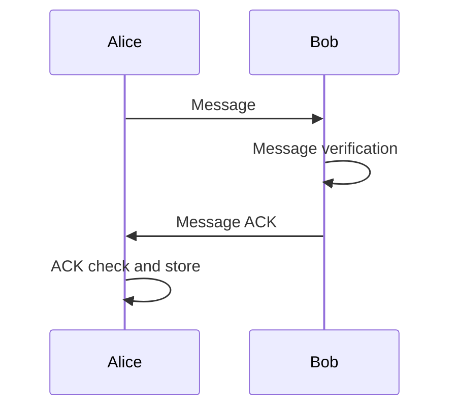

# DecentraChat

## Abstract

DecentraChat (in advance DC) aims to be a pure decentralized chat for the people.

Nowadays internet communications are completely centralized. This centralization its not only technical, but organizational. Big companies own all the data. Their algorithms prioritize arbitrary information in favour of their own _interests_. Its time to create a fully open source proposal to address this problem by omitting all centralized entities.

DC would work in a variety of conditions. Its not assumed the internet will be there for us. We can think on Ethernet networks, even p2p Bluetooth. Multiple communication mediums should be taken into account as possible alternative transports. DC should develop the proper code infrastructure in order to allow the extension of such transports by the community.

It could make use other protocols to extend the peer discovery operation to the entire internet.

DC would make use of asymmetric cryptography for authentication, non repudiation and encryption of messages. [Hybrid encryption](https://en.wikipedia.org/wiki/Hybrid_cryptosystem) modes will be encouraged for performance reasons.

All the messages in DC are going to be public by nature. That doesn't mean everyone can read them. They will be encrypted with high cryptographic standards.

A decentralized blockchain which backs messages could be studied in further iterations. The current design should take that possibility into account. At the time of this write, the `message` will represent the main unit work among `peers`, which will be each application.

With DC people will have true ownership regarding communications. It will introduce strong end to end encryption, non-repudiation and decentralization. The idea that each message would be signed by peers favours the use of DC for as an example, make deals and have a proof of acceptance of the involved parts, even if there is no internet.

## The protocol

Following sections will explain the DC protocol. DC will use chat mechanics for communication, but will make use of the known [PGP](https://www.rfc-editor.org/rfc/rfc4880) standard for message payload compression, encryption, signing and authentication. This would also make DC able to import existing GPG keys already in use in many emails systems.

### Peer discovery (LAN)

Peers will use [IP multi-casting](https://datatracker.ietf.org/doc/html/rfc1112) in order to notify other peers their presence in the network.

The first thing a `peer` will do when after starting the application is to join the multi-cast group `239.255.40.91` , as its located in the [Organization-Local Scope](https://www.ietf.org/rfc/rfc2365.txt) block in the [IANA address space](https://www.iana.org/assignments/multicast-addresses/multicast-addresses.xhtml).

Each peer will emit its multi-cast `UDP` announce packet at intervals of 5 seconds. Heres is the intended datagram:

```bash
protocol "type(4):4,address(32):32,port(16):16,nick len(7):7,nick:31,v len(6):6,v:32,key fingerprint(256):256"

 0                   1                   2                   3  
 0 1 2 3 4 5 6 7 8 9 0 1 2 3 4 5 6 7 8 9 0 1 2 3 4 5 6 7 8 9 0 1
+-+-+-+-+-+-+-+-+-+-+-+-+-+-+-+-+-+-+-+-+-+-+-+-+-+-+-+-+-+-+-+-+
|type(4)|                      address(32)                      |
+-+-+-+-+-+-+-+-+-+-+-+-+-+-+-+-+-+-+-+-+-+-+-+-+-+-+-+-+-+-+-+-+
|       |            port(16)           | nick len(7) |         |
+-+-+-+-+-+-+-+-+-+-+-+-+-+-+-+-+-+-+-+-+-+-+-+-+-+-+-+-+-+-+-+-+
|                           nick                       |v len(6)|
+-+-+-+-+-+-+-+-+-+-+-+-+-+-+-+-+-+-+-+-+-+-+-+-+-+-+-+-+-+-+-+-+
|                               v                               |
+-+-+-+-+-+-+-+-+-+-+-+-+-+-+-+-+-+-+-+-+-+-+-+-+-+-+-+-+-+-+-+-+
|                                                               |
+                                                               +
|                                                               |
+                                                               +
|                                                               |
+                                                               +
|                                                               |
+                      key fingerprint(256)                     +
|                                                               |
+                                                               +
|                                                               |
+                                                               +
|                                                               |
+                                                               +
|                                                               |
+-+-+-+-+-+-+-+-+-+-+-+-+-+-+-+-+-+-+-+-+-+-+-+-+-+-+-+-+-+-+-+-+
```
The above datagram has a total max size of `4 + 32 + 16 + (2^7*8) + (2^6*8) + 256 = 1844 bits` (around 230 bytes) , which is lower regarding size from the [maximum UDP packet size](https://stackoverflow.com/a/35697810), which is `508 bytes`. So all the discovery information fits in the same packet of an unreliable transport like UDP.

Other protocols like [multicast dns](https://en.wikipedia.org/wiki/Multicast_DNS) could be taken into account.

Lets describe the multiple parts:

* The `type` field will indicate the message type, its an unsigned integer, which in this case will be `1` (discovery).

* The `address` (ipv4) field and `port` fields will indicate each peer how to contact each other.

Then we have the variable length fields `nick` and `version`.

* The `nick` field will be the human readable name that peers will present to each other. It will be the `email` present in the public `PGP` key. No way of controlling duplicates here, but the users will have more information than the nickname in order to distinguish among peers, like `key fingerprints`. In order to make this more user friendly, users should be able to permanently associate `key fingerprints` with fixed nicknames.

* The `v` (version) field will indicate the application version. If there are incompatibilities among peers, they should be detected at this point.

* The `key fingerprint` is the `SHA256(pub_key_blob)` value. This will unequivocally identify a peer, in a similar way [SSH](https://www.rfc-editor.org/rfc/rfc4253) does with machines on the first connection, but in this case to associate `nickname` and `key fingerprint`. The `key fingerprint` field will be used lately by the application to know if a new `key exchange` operation is needed or not (see following sections).

### Key exchange

This operation may take place just before of sending the first message to a peer, which was previously detected by the discovery system (see above section).

This operation will take place only if the application cannot find an existing public key that matches the `key fingerprint` obtained during the `discovery operation`. In that case, the application will add it to its database for future use.


This is will be the request message that peers should send to each other.

```bash
protocol "type(4):4"
0                   1                   2                   3  
 0 1 2 3 4 5 6 7 8 9 0 1 2 3 4 5 6 7 8 9 0 1 2 3 4 5 6 7 8 9 0 1
+-+-+-+-+-+-+-+-+-+-+-+-+-+-+-+-+-+-+-+-+-+-+-+-+-+-+-+-+-+-+-+-+
|type(4)|
+-+-+-+-+
```

* The `type` field value of this message will be the unsigned integer `2`.


This is will be the response message that peers should send back to each other.

```bash
protocol "type(4):4, key len(16):16, key data:76"

 0                   1                   2                   3  
 0 1 2 3 4 5 6 7 8 9 0 1 2 3 4 5 6 7 8 9 0 1 2 3 4 5 6 7 8 9 0 1
+-+-+-+-+-+-+-+-+-+-+-+-+-+-+-+-+-+-+-+-+-+-+-+-+-+-+-+-+-+-+-+-+
|type(4)|           key len(16)         |                       |
+-+-+-+-+-+-+-+-+-+-+-+-+-+-+-+-+-+-+-+-+                       +
|                                                               |
+                            key data                           +
|                                                               |
+-+-+-+-+-+-+-+-+-+-+-+-+-+-+-+-+-+-+-+-+-+-+-+-+-+-+-+-+-+-+-+-+
```

* The `type` field value of this message will be the unsigned integer `3`.

* The `key data` field will host the public key which must be in [PEM format](https://en.wikipedia.org/wiki/Privacy-Enhanced_Mail) (PGP flavor). Once the key is received by a peer, it will store it in its database, associated with its `key fingerprint`, which is the sha256 hash of the public key.

### Message

The message format that peers will send to each other:

```bash
protocol "type(4):4, uuid(128):128, prev hash(256): 256, timestamp(32):32, source(256):256,destination(256):256, headers len(16):16, headers:44, data len(32):32, data:28, signature len(16):16, signature:52"

 0                   1                   2                   3  
 0 1 2 3 4 5 6 7 8 9 0 1 2 3 4 5 6 7 8 9 0 1 2 3 4 5 6 7 8 9 0 1
+-+-+-+-+-+-+-+-+-+-+-+-+-+-+-+-+-+-+-+-+-+-+-+-+-+-+-+-+-+-+-+-+
|type(4)|                                                       |
+-+-+-+-+                                                       +
|                                                               |
+                                                               +
|                                                               |
+                                                               +
|                            uuid(128)                          |
+       +-+-+-+-+-+-+-+-+-+-+-+-+-+-+-+-+-+-+-+-+-+-+-+-+-+-+-+-+
|       |                                                       |
+-+-+-+-+                                                       +
|                                                               |
+                                                               +
|                                                               |
+                                                               +
|                                                               |
+                                                               +
|                                                               |
+                                                               +
|                                                               |
+                                                               +
|                                                               |
+                                                               +
|                         prev hash(256)                        |
+       +-+-+-+-+-+-+-+-+-+-+-+-+-+-+-+-+-+-+-+-+-+-+-+-+-+-+-+-+
|       |                      timestamp(32)                    |
+-+-+-+-+-+-+-+-+-+-+-+-+-+-+-+-+-+-+-+-+-+-+-+-+-+-+-+-+-+-+-+-+
|       |                                                       |
+-+-+-+-+                                                       +
|                                                               |
+                                                               +
|                                                               |
+                                                               +
|                                                               |
+                                                               +
|                                                               |
+                                                               +
|                                                               |
+                                                               +
|                                                               |
+                                                               +
|                           source(256)                         |
+       +-+-+-+-+-+-+-+-+-+-+-+-+-+-+-+-+-+-+-+-+-+-+-+-+-+-+-+-+
|       |                                                       |
+-+-+-+-+                                                       +
|                                                               |
+                                                               +
|                                                               |
+                                                               +
|                                                               |
+                                                               +
|                                                               |
+                                                               +
|                                                               |
+                                                               +
|                                                               |
+                                                               +
|                        destination(256)                       |
+       +-+-+-+-+-+-+-+-+-+-+-+-+-+-+-+-+-+-+-+-+-+-+-+-+-+-+-+-+
|       |         headers len(16)       |                       |
+-+-+-+-+-+-+-+-+-+-+-+-+-+-+-+-+-+-+-+-+                       +
|                             headers                           |
+-+-+-+-+-+-+-+-+-+-+-+-+-+-+-+-+-+-+-+-+-+-+-+-+-+-+-+-+-+-+-+-+
|                          data len(32)                         |
+-+-+-+-+-+-+-+-+-+-+-+-+-+-+-+-+-+-+-+-+-+-+-+-+-+-+-+-+-+-+-+-+
|                          data                         |       |
+-+-+-+-+-+-+-+-+-+-+-+-+-+-+-+-+-+-+-+-+-+-+-+-+-+-+-+-+-+-+-+-+
|    signature len(16)  |                                       |
+-+-+-+-+-+-+-+-+-+-+-+-+                                       +
|                            signature                          |
+-+-+-+-+-+-+-+-+-+-+-+-+-+-+-+-+-+-+-+-+-+-+-+-+-+-+-+-+-+-+-+-+

```

* `type` field for this message will be the unsigned integer `4`.

* `uuid` field its an [UUID](https://www.rfc-editor.org/rfc/rfc4122.html) v4 that needs to be added to every message by the application, so previous messages can be easy referenced and found later.

* `prev hash` field will be the SHA256 sum of the last acknowledged message in the conversation. In case this is the first message of the conversation, this field will be filled with zeroes. 

* `timestamp` field is an unsigned four-octet number containing the number of seconds elapsed since midnight, 1 January 1970 UTC. Represents the moment of the message signing, which should be close to the send time.

* `source` field is the SHA256 hash value of the sender public key. Creator of the message should add its public key fingerprint here.

* `destination` field is the SHA256 hash value of the receiver public key.

* `headers` is a variable length field. It can be used to add extra metadata to the message in a key value fashion. The specific format for this field could be borrowed from the [HTTP headers standard](https://www.rfc-editor.org/rfc/rfc7230#section-3.2).
  
* `data` a variable length field for the content of the message, which will accomplish the [Open PGP message format](https://www.rfc-editor.org/rfc/rfc4880).
  
* `signature` its a variable length field for hosting the signature of the whole message. The signature will be computed by putting the hashes of all relevant message fields together, separated by a line break. Here is an example of how the `message data block` would be:

```bash
uuid
timestamp
source
destination
SHA256(headers)
SHA256(data)
```
Then the above block would be hashed by `SHA256(message_hashes_block)` . The resultant hash would be signed with the sender private key. Finally, the signature would be appended to the end of the message.

The only encrypted field of the message will be the `data` field, dedicated to the [Open PGP message format](https://www.rfc-editor.org/rfc/rfc4880). Rest of the fields are probably going to be needed for further processing of the messages by other parts of the system, thus they are signed, but not encrypted.

Although [Open PGP message format](https://www.rfc-editor.org/rfc/rfc4880) standard allows adding metadata to their format, its important to mention that many `PGP` implementations are limited in terms the amount of metadata an user can access. So the use of `PGP` on this proposal is limited to its basic functions, and should remain scoped in the `data` field.

### Message verification process

Each peer should always verify all the received messages. Multiple verifications should happen here per each message:

1. The signature verification at DC message level. It should replay the signature hashing process (see Message section) and compare the resultant hash with the signature one, which should be decrypted with the sender public key.

2. The `timestamp` should not be too in the past nor in the future. Of course, we cannot provide accurate measurements here, but should work in a best effort way.

3. The `UUID` should be present in the message header.

4. The standard expected `PGP` message content decryption and verification. The `data` field of the DC message contains the `PGP` message.


With this verification scheme (peers), users should be naturally motivated to have their system clocks properly adjusted, as no legitimate user would like to accept invalid messages.

We assume the clocks in both systems are more or less aligned. But its true that we would be relaying a bit in local clocks, which are depending on centralized infrastructure when syncing.

Messages exceeding the configured time window or breaking any other validation should be logged, dropped and not presented to the user.

### Message acknowledgement

The message acknowledgement wraps the `message verification` process and happens under the hood, although a visual signal (like a double check) should be shown to users.

Its a special message which is returned to the sender after each successful received/verified message.



The following message will be returned to the sender.

```bash
protocol "type(4):4, uuid(128):128, message hash(256):256, acknowledger(256):256, signature len(16):16, signature:44"

 0                   1                   2                   3  
 0 1 2 3 4 5 6 7 8 9 0 1 2 3 4 5 6 7 8 9 0 1 2 3 4 5 6 7 8 9 0 1
+-+-+-+-+-+-+-+-+-+-+-+-+-+-+-+-+-+-+-+-+-+-+-+-+-+-+-+-+-+-+-+-+
|type(4)|                                                       |
+-+-+-+-+                                                       +
|                                                               |
+                                                               +
|                                                               |
+                                                               +
|                            uuid(128)                          |
+       +-+-+-+-+-+-+-+-+-+-+-+-+-+-+-+-+-+-+-+-+-+-+-+-+-+-+-+-+
|       |                                                       |
+-+-+-+-+                                                       +
|                                                               |
+                                                               +
|                                                               |
+                                                               +
|                                                               |
+                                                               +
|                                                               |
+                                                               +
|                                                               |
+                                                               +
|                                                               |
+                                                               +
|                        message hash(256)                      |
+       +-+-+-+-+-+-+-+-+-+-+-+-+-+-+-+-+-+-+-+-+-+-+-+-+-+-+-+-+
|       |                                                       |
+-+-+-+-+                                                       +
|                                                               |
+                                                               +
|                                                               |
+                                                               +
|                                                               |
+                                                               +
|                                                               |
+                                                               +
|                                                               |
+                                                               +
|                                                               |
+                                                               +
|                     acknowledger(256)                         |
+       +-+-+-+-+-+-+-+-+-+-+-+-+-+-+-+-+-+-+-+-+-+-+-+-+-+-+-+-+
|       |        signature len(16)      |                       |
+-+-+-+-+-+-+-+-+-+-+-+-+-+-+-+-+-+-+-+-+                       +
|                            signature                          |
+-+-+-+-+-+-+-+-+-+-+-+-+-+-+-+-+-+-+-+-+-+-+-+-+-+-+-+-+-+-+-+-+
```

* `type` field represents an unsigned integer with value `5`

* `uuid` field represents the identifier of the message we are acknowledging.

* `message hash` field represents the SHA256 sum of the message its being acknowledged.

* `acknowledger` represents acknowledger `sha256` public `key fingerprint`.


Receivers of the message acknowledge will save this acknowledges in disk. They are interested on that.

### Message reply and acceptance

Message reply refers to the ability for an user to mention, or reply a specific message. This covers scenarios in which we want a proof
of acceptance regarding a specific message. Lets see an example:

1. Alice: Hey Bob ! i am thinking on selling my car. Would you accept it for 10k $ ?
2. Alice: Please think about it :)
3. Bob: Hey Alice, looks like a good deal. I accept it.

In the above example, Bob its interested in accepting the offer. In order to do that, instructs the application to 
"reply this message" for message `1`. Under the hood, the application sets 2 special headers (As specified in the message section) in the reply message (`3`) : 

```bash
Reply-To-UUID: bb559310-4387-4878-a570-7bdcbb990298
Reply-To-Hash: 92d06d293efe3722f95732ce68b2ccef33c1a80900837e99c90ef9fbde4a3812
```
The headers points to the message `1` UUID and its SHA256 hash respectively. This generates the desired proof of acceptance
by cryptographically linking the messages.

### Blockchain

Peers could synchronize messages and messages acknowledges with an external blockchain. Such blockchain would provide a third party of trust. It would also group and store the messages in a distributed world-wide redundant fashion.

As we can see on this proposal, we are already chaining messages. An study about a data structure that would help to preserve such chains independently in a common, traversable data structure, is of the
interests of this project.

### Global discovery mechanisms

In future versions global discovery distributed systems based on the internet could be studied.

Its also interesting to develop ways to interact with Open PGP public keys servers like [keyserver.ubuntu.com](keyserver.ubuntu.com) for gathering public keys.


## Conclusion

We proposed a decentralized chat system that would take all the benefits from current open source cryptography
standards, being able to ensure encryption and non repudiation. It also brings a solution for acknowledging
messages both, at machine level and human level. As long as the peers have a connection among them, they can continue exchanging messages.


## Resources

Kudos to https://github.com/luismartingarcia/protocol for protocol message ASCII generator.